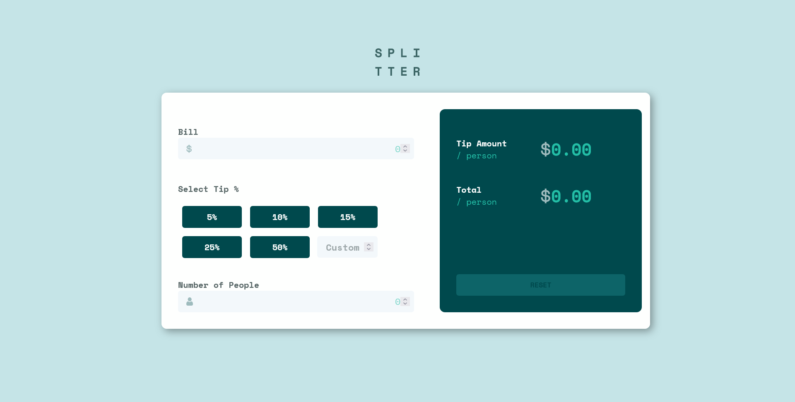

<h1 align="center">Tip calculator app</h1>

Projeto retirado do [Frotend Mentor](https://www.frontendmentor.io/challenges/tip-calculator-app-ugJNGbJUX) utilizando as seguintes ferramentas: 

  
  
  
  

## Funcionalidades 

- Calcular a gorjeta correta e o custo total da conta por pessoa
- Ver layout ideal para o aplicativo dependendo do tamanho da tela do dispositivo
- Ver os estados de foco para todos os elementos interativos na página

## Como Executar

Para executar o aplicativo, basta abrir o arquivo index.html em um navegador da web compatível.

[Ou clique ai e será direcionado ao site ativo](https://tatyane-goncalves.github.io/Tip-calculator-app/)

## Autor
Este aplicativo foi desenvolvido por Tatyane Gonçalves.